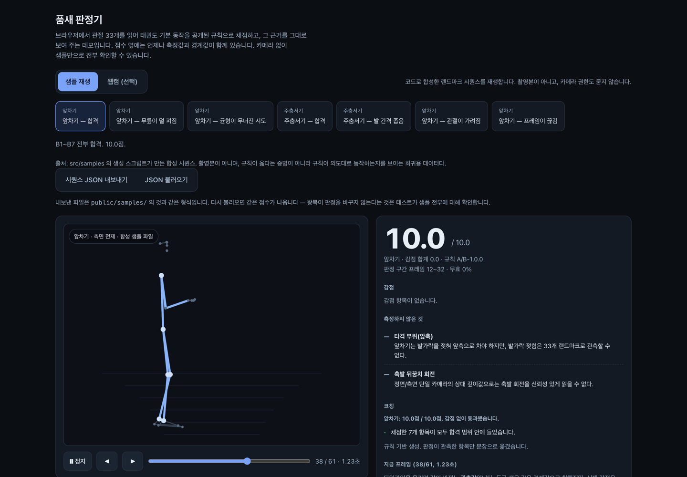
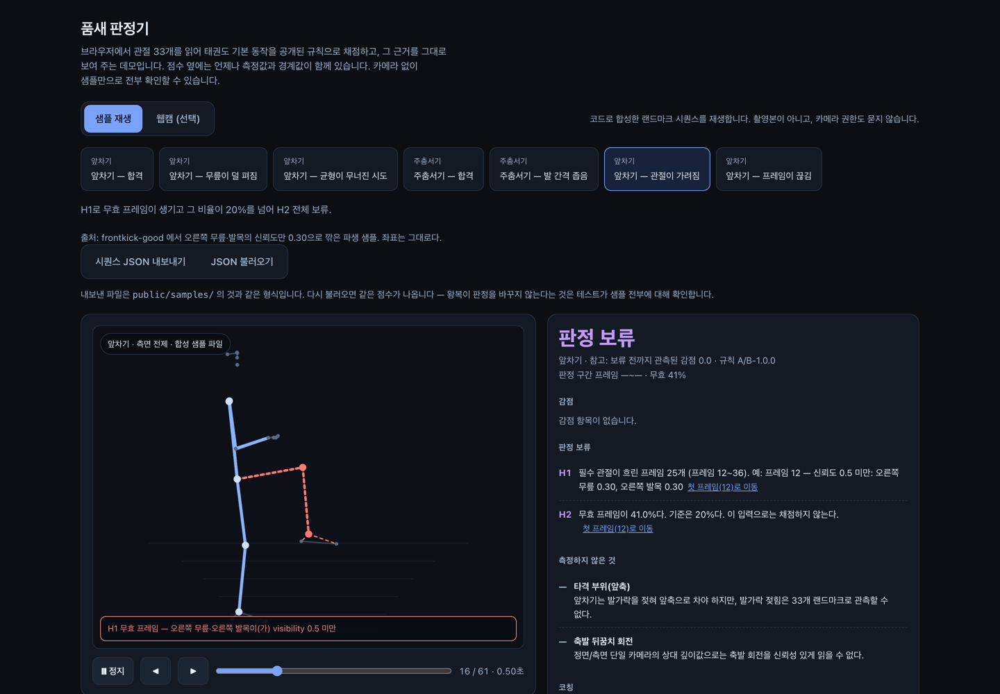
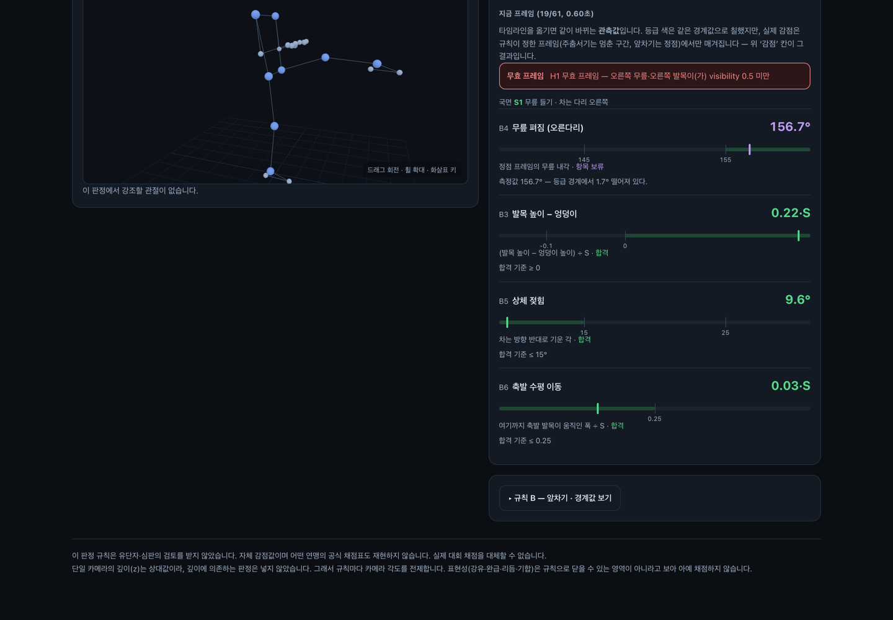

# 품새 판정기

브라우저에서 관절 33개를 읽어 태권도 기본 동작을 **공개된 규칙으로** 채점하고,
그 판정의 근거를 그대로 보여 주는 웹 데모입니다. 점수 옆에는 언제나 측정값과
경계값이 함께 있고, 애매한 입력에는 점수를 주지 않습니다.

**▶ 바로 열어 보기: https://poomsae-judge.vercel.app** — 설치도 카메라 권한도 없이, 샘플을 눌러 판정과 그 근거를 확인할 수 있습니다.
같은 빌드가 GitHub Pages에도 올라갑니다: <https://min-heee.github.io/poomsae-judge/>

> 이 프로젝트가 풀려는 문제는 "점수"가 아니라 **"근거"** 입니다. 품새 채점에서
> 반복적으로 문제가 되는 것은 왜 깎였는지가 남지 않는다는 점이고, 그래서 모든
> 경계값을 화면과 문서에 드러낸 채로 채점합니다.



*샘플 재생 모드. 점수(10.0) 옆에 판정 구간과 감점 항목이 같이 나옵니다.*



*신뢰도가 낮은 입력은 점수를 만들지 않고 **판정 보류**로 떨어집니다. 사유(H1 흐린 관절 25프레임, H2 무효 41%)와 그 프레임으로 가는 링크, 그리고 애초에 **측정하지 않는 항목**(타격 부위, 축발 뒤꿈치 회전)까지 화면에 적습니다.*



*아래쪽 3D 뷰는 돌려 볼 수 있고, 판정이 실제로 읽은 관절만 칠합니다.*

## 심사위원이 30초에 보는 법

**카메라가 필요 없습니다.** 첫 화면이 샘플 재생 모드라 권한을 묻지 않습니다.

1. 배포 주소(https://poomsae-judge.vercel.app)를 열거나, 로컬에서 `npm install && npm run dev` → <http://localhost:3000>
2. 샘플 하나를 누릅니다. 바로 판정 카드가 뜹니다. **여기까지 클릭 한 번.**
3. **"앞차기 — 관절이 가려짐"** 을 눌러 봅니다. 점수 대신 **판정 보류**가 뜨고,
   왜 읽지 못했는지와 몇 번 프레임이 문제였는지가 나옵니다. 보류는 0점이 아니라
   **"채점하지 않음"** 입니다.
4. 감점 줄의 `프레임 40으로 이동` 을 누르면 타임라인이 그 프레임으로 갑니다.
   화면의 숫자가 판정이 실제로 읽은 값이라는 것을 그 자리에서 확인할 수 있습니다.

샘플 7개 중 5개는 점수가 나오고, 2개는 일부러 손상시킨 입력이라 보류로 떨어집니다.
새로고침해도 같은 점수가 나옵니다 — 판정은 결정적입니다.

## 무엇을 판정하는가

동작 두 가지만, 정확성 축만 봅니다. 기준 길이는 좌우 어깨 사이 거리 **S** 이고
모든 길이를 S로 나눕니다(키와 카메라 거리에 무관해집니다). 아래 값은 전부
`src/judge/constants.ts` **한 곳**에 있고, 앱 안의 규칙 표도 같은 상수를 읽습니다.

### 규칙 A — 주춤서기 (정면 촬영 전제)

| 항목 | 지표 | 합격 | 0.1 감점 | 0.3 감점 |
|---|---|---|---|---|
| A1 발 간격 | 좌우 발목 수평거리 ÷ S | 1.70 ~ 2.30 | 1.50~1.70, 2.30~2.60 | 그 밖 |
| A2 무릎 굽힘 | 엉덩이–무릎–발목 내각 (나쁜 쪽) | ≤ 145° | 145~160° | > 160° |
| A3 좌우 대칭 | 좌우 무릎각 차 | ≤ 8° | 8~15° | > 15° |
| A4 상체 수직 | 엉덩이중점→어깨중점 벡터와 수직축의 각 | ≤ 10° | 10~18° | > 18° |
| A5 유지·흔들림 | 멈춘 구간 ≥ 0.8초, 그 구간 *발목 평균 대비 엉덩이 높이*의 표준편차 ≤ 0.03·S | 충족 | 미충족 | — |

### 규칙 B — 앞차기 (측면 촬영 전제, 상태 기계)

S0 준비 → S1 들기(무릎각 ≤ 100°, 무릎이 엉덩이 높이 이상) → S2 뻗기(무릎각 ≥ 155°)
→ S3 회수(무릎각 ≤ 110°) → S4 착지.

| 항목 | 조건 | 감점 |
|---|---|---|
| B1 순서 위반 | S1 없이 S2 도달 | 0.3 |
| B2 회수 생략 | S2 → S4 직행 | 0.3 |
| B3 높이 부족 | 정점 발목이 엉덩이 높이 미만 | 0.3 (0.1·S 이내면 0.1) |
| B4 펴짐 부족 | 정점 무릎각 145~155° / < 145° | 0.1 / 0.3 |
| B5 상체 젖힘 | 뒤로 > 15° / > 25° | 0.1 / 0.3 |
| B6 축발 흔들림 | 축발 수평 이동 > 0.25·S | 0.1 |
| B7 뻗기 지연 | S1 → S2 > 0.5초 | 0.1 |

동작당 10.0에서 감점을 뺍니다. **연맹 채점표를 재현하지 않습니다** — 감점 값은
이 프로젝트가 정한 값입니다.

### 애매한 입력은 닫는다 — 판정 보류 H1~H7

| 코드 | 조건 | 결과 |
|---|---|---|
| H1 | 필수 8점(어깨·엉덩이·무릎·발목) 중 하나라도 visibility < 0.5 | 그 프레임 무효 |
| H2 | 무효 프레임 비율 > 20% | 전체 보류 |
| H3 | 인접 프레임 간격 > 120ms | 전체 보류 (그 이하는 선형 보간) |
| H4 | 지표가 등급 경계의 ±ε 안 (각도 2°, 비율 0.05·S, 시간 0.03초, 작은 문턱은 ±5%) | **그 항목만** 보류, 총점에서 제외 |
| H5 | 항목 보류 2개 이상 | 전체 보류 |
| H6 | 선언된 카메라 각도가 규칙의 전제와 다름 | 전체 보류 |
| H7 | 주춤서기로 볼 **멈춘 구간이 없음** — 적어도 한쪽 무릎 ≤ 160° · 발 간격 ≥ 1.2·S · 엉덩이 상하 속도 ≤ 0.06m/s 인 구간이 0.2초 이상 이어진 적 없음 | 전체 보류 |

경계에서 점수를 주고 나중에 "오차 범위였다"고 말하는 것보다, **처음부터 재지
않았다고 말하는 편이 반박 가능합니다.** 그것이 H4의 취지입니다.

**H7은 "나쁜 자세"와 "자세 아님"을 가릅니다.** 카메라 앞에 차렷으로 서 있기만 해도
A3(좌우 대칭)·A4(상체 수직)는 그대로 통과하므로, H7이 없으면 아무 동작도 하지 않은
사람이 감점 몇 개만 붙은 점수를 받았습니다. 문턱은 '자세 아님'에만 닿도록 좁게
잡았습니다 — **한쪽이라도** 무릎을 굽혀 발을 벌린 채 0.2초만 멈추면 채점하고,
그 구간이 A5의 기준(0.8초)보다 짧다는 사실은 A5가 0.1 감점으로 말합니다.

양쪽 무릎을 함께 요구하지 않는 데에는 이유가 둘 있습니다. 한쪽만 굽힌 비대칭
주춤서기는 *나쁜 자세*이지 자세가 아닌 것이 아니고 — 그것을 감점하려고 만든 항목이
바로 A2·A3입니다 — 게다가 양쪽에 걸면 판정 구간 안의 모든 프레임이 양쪽 ≤ 160°가
되어 **A2의 0.3 감점 칸(> 160°)에 어떤 입력으로도 도달할 수 없게** 됩니다. 규칙 표가
화면에 띄우는 칸이 코드로는 닿을 수 없는 칸이 되는 것입니다. 그래서 "주춤서기를
시도했는가"는 더 굽은 쪽 무릎으로 보고, "얼마나 못 굽혔는가·얼마나 비대칭인가"는
A2·A3가 감점으로 말합니다.

### 측정하지 않기로 선언한 것

빈칸으로 두지 않고 화면에 이유와 함께 표시합니다 — 발끝 방향(정면에서 신뢰도가
낮음), 체중 배분(압력 센서 없이 관측 불가), 타격 부위(발가락 젖힘은 33개
랜드마크로 관측 불가), 축발 뒤꿈치 회전(단일 카메라의 상대 깊이로는 불가).
**옆차기를 채점 대상에서 뺀 것도 같은 이유입니다** — 읽을 수 없는 것은 채점하지
않습니다.

## 화면 구성

| 영역 | 무엇이 있나 |
|---|---|
| 입력 모드 | **샘플 재생**(기본, 권한 없음) / 웹캠(선택, 버튼을 눌러야 켜지고 탭을 떠나면 꺼짐) |
| 자세 화면 | 2D 오버레이 + 프레임 타임라인. 뱃지에 동작·전제 각도·출처 |
| 판정 카드 | 점수 → 감점(측정값·경계값 게이지) → 보류 사유 → 미측정 → 코칭 → 지금 프레임의 값 |
| 3D 스켈레톤 | 감점·보류가 걸린 항목이 **실제로 읽은 관절만** 붉게. 근거가 없으면 강조도 없음 |
| 규칙 표 | 위 표를 앱 안에서 열람. 코드와 같은 상수를 읽으므로 어긋날 수 없음 |
| 시퀀스 파일 | JSON 내보내기·불러오기. 내보낸 것을 되먹이면 같은 점수가 나옴 |

## 기술 스택과 이유

| 선택 | 왜 |
|---|---|
| **Next.js 15 (App Router) + 정적 내보내기** | 심사위원이 서버를 띄울 이유가 없다. `output: 'export'` 라 런타임 서버가 없고, 그래서 **배포물에 비밀값이 들어갈 자리 자체가 없다** |
| **MediaPipe Tasks-Vision (브라우저 WASM)** | 촬영 대상이 도장의 미성년 수련생일 수 있다. 영상이 서버로 가지 않으면 보관·동의·유출 문제가 통째로 사라진다. 부수 효과로 설치가 0이 된다 |
| **규칙 기반 (학습 모델 아님)** | 풀려는 문제가 점수가 아니라 근거다. 규칙은 경계값을 드러낼 수 있고 지도자가 반박·조정할 수 있다. 학습 모델은 같은 점수를 내도 왜 그 점수인지 말하지 못한다 |
| **순수 함수 + vitest** | 결정성의 전제. `src/judge/` 는 DOM·카메라·네트워크·`Date.now()`·`Math.random()` 을 쓰지 않는다 |
| **three.js 직접 (R3F 없음)** | 점과 선만 그리는 데 React 렌더러 계층이 필요 없다. 동적 import 로 떼어 초기 번들에서 뺐다 |
| **합성 샘플** | 녹화는 결정성이 추론 백엔드에 묶이고, 무엇보다 **실패 케이스를 의도적으로 만들 수 없다** |

판정의 입력은 영상이 아니라 **랜드마크 시퀀스**입니다. 이것이 결정성의 실제
경계입니다 — 브라우저 추론 자체는 백엔드와 버전에 따라 흔들릴 수 있지만,
샘플 모드는 추론을 아예 건너뜁니다.

```
src/judge/       판정 코어 — 순수 함수. 규칙 A·B, 보류 H1~H7, 상수 단일 출처
src/pose/        입력 계층 — 샘플 JSON 재생, 웹캠 추론, 내보내기·불러오기
src/samples/     합성 시퀀스 생성기 (앱 번들에 들어가지 않음)
src/components/  화면 — 게이지, 타임라인, 3D 스켈레톤
```

## AI 코딩 툴 사용 방식

**PRD를 먼저 쓰고 구현했습니다.** 말이 아니라 커밋 이력으로 확인할 수 있습니다.

```bash
git log --reverse --format='%h %s'      # 첫 커밋이 코드가 아니라 문서다
git show --stat f17c07e                 # docs/PRD.md 한 파일, 144줄
```

사람이 정한 것은 **채점할 동작, 경계값과 감점 값, 보류 조건, 그리고 무엇을
측정하지 않을지** 입니다. 5절의 숫자는 AI에게 정하게 하지 않았습니다. AI에
맡긴 것은 스캐폴딩·렌더링·타입·테스트 확장, 그리고 **문서와 구현이 어긋난 곳을
찾는 적대적 검토**입니다.

`docs/PRD.md` 7절에 **AI가 처음에 틀렸던 지점 11건**을 무엇이 어떻게 드러났고
어떻게 고쳤는지까지 표로 적었습니다. 몇 가지만 옮기면:

- **초안의 A5 지표 정의가 틀렸습니다.** `worldLandmarks` 는 엉덩이 중점이
  원점이라 "엉덩이 높이의 표준편차"는 정의상 항상 0입니다. 적힌 대로 구현하면
  A5 흔들림은 어떤 입력에서도 통과합니다.
- **초안의 F9(LLM 서버 라우트)는 F8(정적 배포)과 양립하지 않았습니다.** 기술
  실사에서 드러나 설계를 바꿨고, PRD에 정정 문단을 남겼습니다.
- **화면 파서가 빠진 `visibility` 를 1.0으로 채우고 있었습니다.** 가려진
  샘플에서 네 번째 칸만 지우면 판정 보류가 10.0 만점이 됐습니다. 검토가
  실행으로 재현했고, 지금은 거부하며 회귀 테스트가 지킵니다.

가장 쓸모 있었던 습관은 **변이를 넣고 테스트가 잡는지 보는 것**이었습니다.
`view` 판정을 상수로 고정해도, 점수 하한을 떼도 테스트가 전부 통과했습니다.
통과한 테스트의 수는 커버리지의 증거가 아닙니다.

## 실행과 검증

```bash
npm install
npm run dev        # 개발 서버 (http://localhost:3000)
npm run build      # 정적 내보내기 → out/
npm run preview    # 내보낸 out/ 을 로컬에서 (의존성 없음, 오프라인 동작)
npm run samples    # public/samples/*.json 을 다시 굽는다
```

```bash
npm run verify     # test → typecheck → lint → build 를 한 번에
```

| 명령 | 결과 |
|---|---|
| `npx vitest run` | **303 passed / 12 files** |
| `npx tsc --noEmit` | 0 errors |
| `npm run lint` | 0 errors, 0 warnings |
| `npm run build` | `output:'export'` 성공, First Load JS 131 kB |

테스트가 확인하는 것은 "규칙이 옳다"가 아니라 **"규칙이 적힌 대로 동작한다"** 입니다.
배포된 `public/samples/*.json` 을 화면과 같은 경로로 읽어 같은 점수가 나오는지,
보류가 0점으로 새지 않는지, 내보낸 JSON을 되먹여도 판정이 같은지, 같은 입력이
항상 같은 출력을 내는지를 봅니다.

GitHub Pages 프로젝트 페이지로 배포할 때만 basePath를 켭니다(워크플로가 자동으로
넣습니다).

```bash
PAGES_BASE_PATH=/poomsae-judge npm run build
```

> `npm audit` 이 상류 의존 4건(postcss 3, @vitest/mocker 1)을 보고합니다. 둘 다
> 빌드·테스트 도구의 의존이고, 런타임 서버도 사용자 입력 CSS도 없는 이 정적
> 데모에는 공격면이 없습니다. 해소하려면 next 16으로 올려야 해 지금은 올리지
> 않았습니다.

## 한계 (먼저 밝힙니다)

- 이 판정 규칙은 **유단자·심판의 검토를 받지 않았습니다.** 자체 감점값이며,
  어떤 연맹의 공식 채점표도 재현하지 않습니다. **실제 대회 채점을 대체할 수
  없습니다.** 특정 단체·기업과 무관한 개인 학습용 데모입니다.
  경계값은 공개 자료를 보고 제가 정한 값이라 언제든 틀릴 수 있습니다. 그래서 값을
  한곳에 모았습니다 — **검증되면 `src/judge/constants.ts` 한 파일만 고치면 판정·화면
  규칙표·테스트가 함께 움직입니다.**
- **샘플은 전부 코드로 만든 합성 시퀀스입니다.** 촬영본이 아닙니다. 합성 좌표는
  규칙이 *옳다*는 것을 증명하지 못하고, 규칙이 *적힌 대로 동작하는지* 만 보입니다.
- 단일 카메라의 깊이(z)는 상대값이라 깊이에 의존하는 판정은 넣지 않았습니다.
  그 대가로 **규칙마다 카메라 각도가 전제됩니다**(주춤서기 정면, 앞차기 측면).
  각도는 관측할 수 없으므로 시퀀스가 선언하고, 전제와 다르면 H6으로 보류합니다.
- 표현성(강유·완급·리듬·기합)은 규칙으로 닫히는 영역이 아니라고 보아 채점하지
  않습니다. **실제 품새 채점에서는 이쪽 비중이 더 큽니다.**
- **웹캠 경로는 실기기로 확증하지 않았습니다.** 개발 환경에 카메라가 없었습니다
  (`docs/TECH-NOTES.md` 11절). 샘플 모드는 추론을 건너뛰므로 판정에는 닿지 않습니다.

## 문서

- **[`docs/PRD.md`](docs/PRD.md)** — 무엇을 왜 만드는지, 판정 규칙과 경계값의
  근거, 설계 결정과 버린 대안, AI 코딩 툴 사용 기록
- **[`docs/TECH-NOTES.md`](docs/TECH-NOTES.md)** — 버전 실측, 런타임 함정,
  검증하지 못한 채 남은 것

## 라이선스

MIT ([`LICENSE`](LICENSE)). 포즈 추정은 MediaPipe 모델을 공식 URL에서 실행 시
내려받아 씁니다 — 모델 가중치는 저장소에 포함하지 않습니다.
