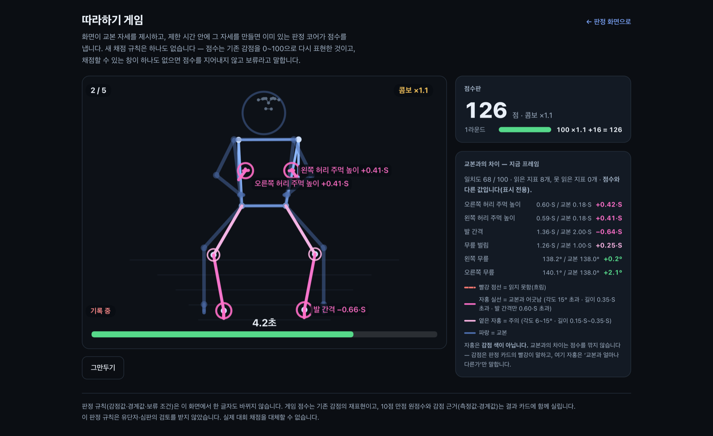
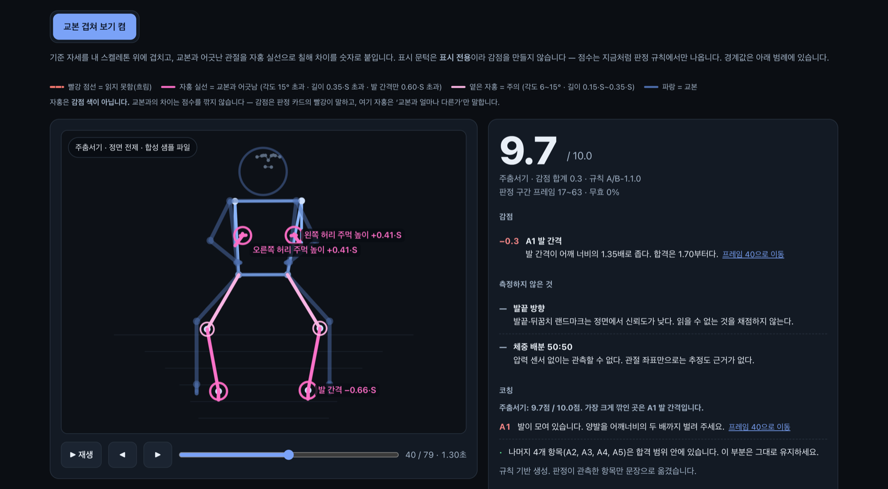
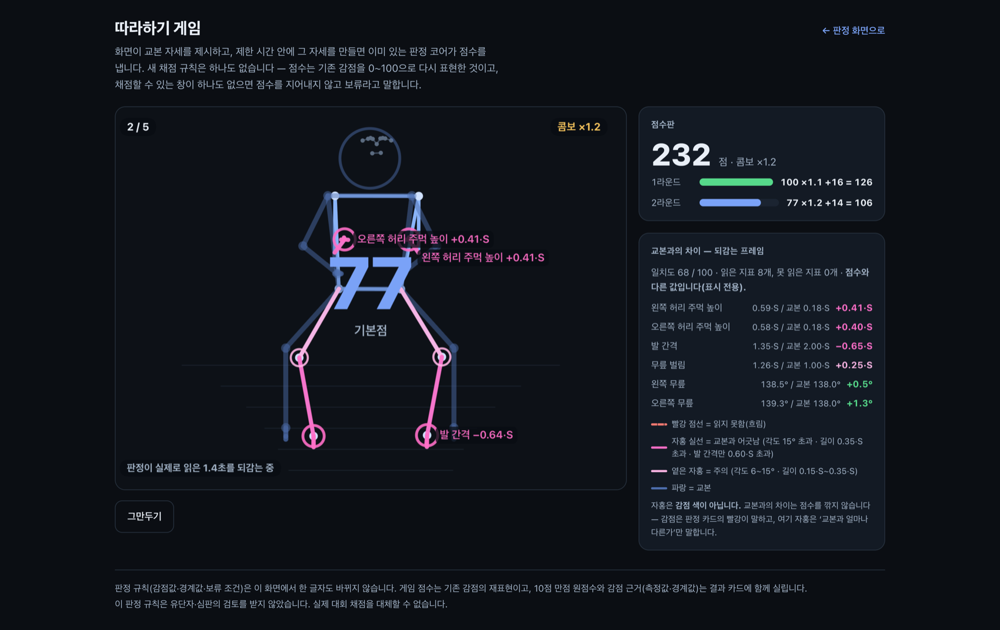
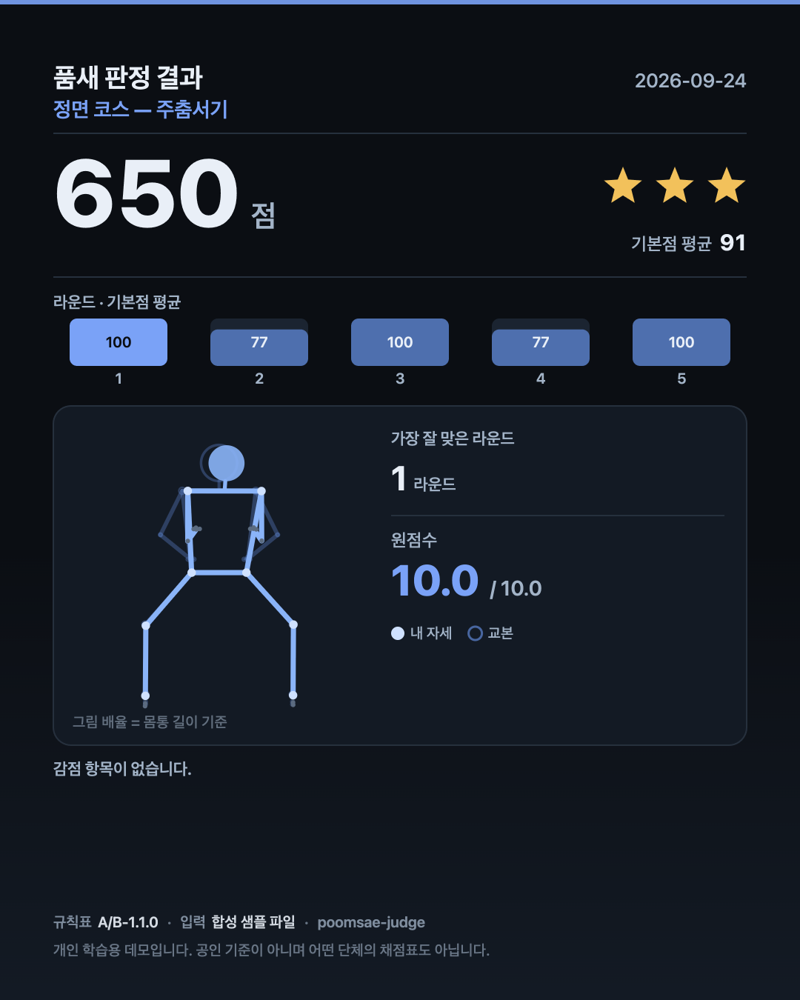
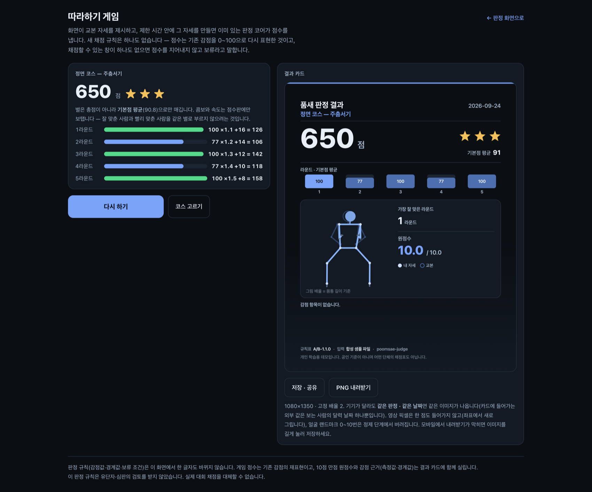

# 품새 판정기

브라우저에서 관절 33개를 읽어 태권도 기본 동작을 **공개된 규칙으로** 채점하고,
그 판정의 근거를 그대로 보여 주는 웹 데모입니다. 점수 옆에는 언제나 측정값과
경계값이 함께 있고, 애매한 입력에는 점수를 주지 않습니다.

그리고 그 판정 코어로 **노는** 화면이 하나 붙어 있습니다 — 따라하기 게임.

**▶ 게임 바로 열기: https://poomsae-judge.vercel.app/game/** — 카메라도 설치도 없이 [시작하기] 한 번이면 5라운드가 1분에 돕니다.
**▶ 판정 화면: https://poomsae-judge.vercel.app** — 샘플을 눌러 판정과 그 근거를 봅니다.
같은 빌드가 GitHub Pages에도 올라갑니다: <https://min-heee.github.io/poomsae-judge/>

> 이 프로젝트가 풀려는 문제는 "점수"가 아니라 **"근거"** 입니다. 품새 채점에서
> 반복적으로 문제가 되는 것은 왜 깎였는지가 남지 않는다는 점이고, 그래서 모든
> 경계값을 화면과 문서에 드러낸 채로 채점합니다. 게임도 같은 규칙 위에서 돕니다 —
> **새 채점 규칙은 한 줄도 만들지 않았습니다.**

## 따라하기 게임 — 세 가지

**카메라가 없어도 셋 다 그대로 보입니다.** 기본이 시연 모드라 권한을 묻지 않고,
이미 커밋된 합성 샘플을 플레이어 입력 자리에 흘려보냅니다. 웹캠 모드와 **같은 코드**를
지나므로, 보이는 것이 곧 웹캠에서 도는 것입니다.



*맞추기 단계. 제한 시간이 줄어드는 동안 어긋난 관절이 실시간으로 칠해집니다. 숫자는 전부 **측정값 / 교본값 / 차이** 세 쌍으로 나옵니다.*

### 1. 교본 오버레이 — 어디가 얼마나 다른가

기준 자세를 내 스켈레톤 **위에** 같은 자로 얹고, 어긋난 관절을 자홍으로 칠해
`발 간격 −0.66·S` 처럼 숫자를 붙입니다. 판정 화면에서도 토글로 켤 수 있습니다.



*같은 발목을 두 층이 각자의 말로 설명합니다 — 오버레이는 "교본보다 0.66·S 좁다", 판정은 "A1 −0.3, 합격은 1.70부터".*

- **색 규약:** 자홍 = 교본과 다름(실선), 빨강 점선 = 흐려서 읽지 못함, 빨강(판정 카드) = 감점.
  **자홍은 감점 색이 아닙니다** — 교본과의 차이는 점수를 깎지 않습니다. 이 구분은 화면의 범례에
  상시 적혀 있고, 색 하나에 기대지 않도록 어긋난 관절에는 링과 숫자 라벨이 함께 붙습니다.
- **한계:** 표시 문턱(각도 6°/15°, 길이 0.15/0.35·S)은 표시 전용이라 감점을 만들지 않습니다.
  앞차기 교본은 **정점 한 순간**이라 그 순간이 아닌 프레임이 어긋나 보이는 것은 당연합니다.

### 2. 게임 루프 — 제시 → 준비 → 맞추기 → 판정

한 판은 **한 코스 5라운드**, 약 1분입니다. 제한 시간이 6 → 5.5 → 5 → 4.5 → 4초로 줄고,
기본점 70 이상이면 콤보가 이어집니다(최대 ×1.5). 코스는 정면(주춤서기)과 측면(앞차기)으로
갈라 둡니다 — 규칙이 카메라 각도를 전제하기 때문에 한 판에서 동작을 섞으면 라운드마다
몸을 90° 돌려야 합니다.



*판정 단계는 **판정이 실제로 읽은 구간**을 되감습니다 — 게임이 고른 창이 아니라 그 안에서 규칙이 다시 고른 구간입니다.*

- **점수:** `기본점 = round(100 × (1 − 총감점 ÷ 채점된 항목의 최대 감점 합))`.
  기존 감점의 **재표현**일 뿐입니다(원점수 8.7~10.0은 변별이 되지 않아 0~100으로 폅니다).
  라운드 점수 = `round(기본점 × 콤보) + 속도점`, 별은 총점이 아니라 **기본점 평균**으로만 매깁니다.
- **판정 창의 함정을 피하는 법:** 판정 창은 본질적으로 과거를 봅니다. 카운트다운이 끝나는
  순간을 스냅샷하면 **준비 자세가 채점됩니다.** 그래서 기록기를 시작 신호에서 열고, 그 이후
  구간에서 창 2.0초를 0.2초 보폭으로 밀며 창마다 기존 판정을 그대로 돌려 가장 잘 맞은 창을
  고릅니다(6초면 후보 21개, 실측 1.19ms). **모든 창이 보류면 라운드도 보류입니다.**
- **한계:** 시연 모드는 결정적이라 몇 번을 눌러도 같은 결과입니다(정면 650점 ★★★ /
  측면 569점 ★★). 심사 환경에서는 그게 맞지만, 리듬게임의 "이번엔 될까"는 웹캠 모드에만
  있습니다. 그리고 시연 샘플의 팔은 판정이 보지 않는 장식이라 기본점 100인 라운드에서도
  주먹이 자홍으로 뜹니다 — 화면이 그 값을 측정값·교본값과 함께 적어 둡니다.

### 3. 결과 카드 — 들고 나갈 한 장

1080×1350 PNG를 캔버스로 그려 내려받습니다(`navigator.share` 가 있으면 먼저 시도).



*카드에는 게임 점수만이 아니라 **10점 만점 원점수와 감점 항목**이 함께 실립니다. 입력원(합성 샘플 / 웹캠)도 적습니다 — 샘플 점수가 자기 기록처럼 보이지 않게.*

- **개인 식별 정보를 두 겹으로 막습니다.** (1) 영상 픽셀이 한 점도 들어가지 않습니다 —
  좌표에서 새로 그립니다. (2) 얼굴 랜드마크 0~10번은 정제 단계에서 버립니다(머리는 원 하나).
  이름 입력칸도 없습니다.
- **결정적입니다.** 고정 크기·고정 배율 2·`devicePixelRatio` 무관이라 같은 판정·같은 날짜면
  기기가 달라도 같은 이미지가 나옵니다. 카드에 들어가는 외부 값은 보는 사람의 달력 날짜 하나뿐입니다.



*한 판이 끝나면 라운드별 `기본점 × 콤보 + 속도점` 이 그대로 남고, 카드가 한 장 떨어집니다.*

## 판정 화면 — 원래 있던 본체

게임은 놀이 층이고, 점수를 내는 것은 그 아래의 판정 코어입니다. 규칙은 순수 함수로
돌고, 화면은 그 결과를 옮길 뿐입니다.


*샘플 재생 모드. 점수(10.0) 옆에 판정 구간과 감점 항목이 같이 나옵니다.*


*신뢰도가 낮은 입력은 점수를 만들지 않고 **판정 보류**로 떨어집니다. 사유(H1 흐린 관절 25프레임, H2 무효 41%)와 그 프레임으로 가는 링크, 그리고 애초에 **측정하지 않는 항목**(타격 부위, 축발 뒤꿈치 회전)까지 화면에 적습니다.*


*아래쪽 3D 뷰는 돌려 볼 수 있고, 판정이 실제로 읽은 관절만 칠합니다.*

> 위 세 장은 규칙표 `A/B-1.0.0` 시점에 찍은 것입니다. 판정 카드의 버전 표기는 지금
> `A/B-1.1.0` 이고(H7 추가), 세 화면의 점수·감점·보류 사유는 그대로입니다.
> 게임·오버레이·카드 화면(위 네 장)은 `A/B-1.1.0` 에서 찍었습니다.

## 심사위원이 30초에 보는 법

**카메라가 필요 없습니다.** 게임은 기본이 시연 모드, 판정 화면은 기본이 샘플 재생이라
어느 쪽도 권한을 묻지 않습니다.

1. **게임부터.** <https://poomsae-judge.vercel.app/game/> → [시작하기]. 제시 → 3·2·1 →
   맞추기 → 판정이 돌고, 5라운드(약 1분) 뒤에 카드가 한 장 나옵니다. **클릭 한 번.**
2. **판정 화면.** <https://poomsae-judge.vercel.app> 에서 샘플 하나를 누르면 바로 판정 카드가
   뜹니다. **"앞차기 — 관절이 가려짐"** 을 눌러 보면 점수 대신 **판정 보류**가 뜹니다 —
   보류는 0점이 아니라 **"채점하지 않음"** 입니다.
3. 감점 줄의 `프레임 40으로 이동` 을 누르면 타임라인이 그 프레임으로 갑니다.
   화면의 숫자가 판정이 실제로 읽은 값이라는 것을 그 자리에서 확인할 수 있습니다.
4. 같은 화면에서 **[교본 겹쳐 보기]** 를 켜면 기준 자세가 겹쳐집니다(기본은 꺼짐 —
   켜지 않으면 이 화면은 예전과 한 픽셀도 다르지 않습니다).

샘플 7개 중 5개는 점수가 나오고, 2개는 일부러 손상시킨 입력이라 보류로 떨어집니다.
새로고침해도 같은 점수, 게임도 같은 총점이 나옵니다 — 판정은 결정적입니다.

## 무엇을 판정하는가

동작 두 가지만, 정확성 축만 봅니다. 기준 길이는 좌우 어깨 사이 거리 **S** 이고
모든 길이를 S로 나눕니다(키와 카메라 거리에 무관해집니다). 아래 값은 전부
`src/judge/constants.ts` **한 곳**에 있고, 앱 안의 규칙 표도 같은 상수를 읽습니다.

### 규칙 A — 주춤서기 (정면 촬영 전제)

| 항목 | 지표 | 합격 | 0.1 감점 | 0.3 감점 |
|---|---|---|---|---|
| A1 발 간격 | 좌우 발목 수평거리 ÷ S | 1.70 ~ 2.30 | 1.50~1.70, 2.30~2.60 | 그 밖 |
| A2 무릎 굽힘 | 엉덩이–무릎–발목 내각 (나쁜 쪽) | ≤ 145° | 145~160° | > 160° |
| A3 좌우 대칭 | 좌우 무릎각 차 | ≤ 8° | 8~15° | > 15° |
| A4 상체 수직 | 엉덩이중점→어깨중점 벡터와 수직축의 각 | ≤ 10° | 10~18° | > 18° |
| A5 유지·흔들림 | 멈춘 구간 ≥ 0.8초, 그 구간 *발목 평균 대비 엉덩이 높이*의 표준편차 ≤ 0.03·S | 충족 | 미충족 | — |

### 규칙 B — 앞차기 (측면 촬영 전제, 상태 기계)

S0 준비 → S1 들기(무릎각 ≤ 100°, 무릎이 엉덩이 높이 이상) → S2 뻗기(무릎각 ≥ 155°)
→ S3 회수(무릎각 ≤ 110°) → S4 착지.

| 항목 | 조건 | 감점 |
|---|---|---|
| B1 순서 위반 | S1 없이 S2 도달 | 0.3 |
| B2 회수 생략 | S2 → S4 직행 | 0.3 |
| B3 높이 부족 | 정점 발목이 엉덩이 높이 미만 | 0.3 (0.1·S 이내면 0.1) |
| B4 펴짐 부족 | 정점 무릎각 145~155° / < 145° | 0.1 / 0.3 |
| B5 상체 젖힘 | 뒤로 > 15° / > 25° | 0.1 / 0.3 |
| B6 축발 흔들림 | 축발 수평 이동 > 0.25·S | 0.1 |
| B7 뻗기 지연 | S1 → S2 > 0.5초 | 0.1 |

동작당 10.0에서 감점을 뺍니다. **연맹 채점표를 재현하지 않습니다** — 감점 값은
이 프로젝트가 정한 값입니다.

### 애매한 입력은 닫는다 — 판정 보류 H1~H7

| 코드 | 조건 | 결과 |
|---|---|---|
| H1 | 필수 8점(어깨·엉덩이·무릎·발목) 중 하나라도 visibility < 0.5 | 그 프레임 무효 |
| H2 | 무효 프레임 비율 > 20% | 전체 보류 |
| H3 | 인접 프레임 간격 > 120ms | 전체 보류 (그 이하는 선형 보간) |
| H4 | 지표가 등급 경계의 ±ε 안 (각도 2°, 비율 0.05·S, 시간 0.03초, 작은 문턱은 ±5%) | **그 항목만** 보류, 총점에서 제외 |
| H5 | 항목 보류 2개 이상 | 전체 보류 |
| H6 | 선언된 카메라 각도가 규칙의 전제와 다름 | 전체 보류 |
| H7 | 주춤서기로 볼 **멈춘 구간이 없음** — 적어도 한쪽 무릎 ≤ 160° · 발 간격 ≥ 1.2·S · 엉덩이 상하 속도 ≤ 0.06m/s 인 구간이 0.2초 이상 이어진 적 없음 | 전체 보류 |

경계에서 점수를 주고 나중에 "오차 범위였다"고 말하는 것보다, **처음부터 재지
않았다고 말하는 편이 반박 가능합니다.** 그것이 H4의 취지입니다.

**H7은 "나쁜 자세"와 "자세 아님"을 가릅니다.** 카메라 앞에 차렷으로 서 있기만 해도
A3(좌우 대칭)·A4(상체 수직)는 그대로 통과하므로, H7이 없으면 아무 동작도 하지 않은
사람이 감점 몇 개만 붙은 점수를 받았습니다. 문턱은 '자세 아님'에만 닿도록 좁게
잡았습니다 — **한쪽이라도** 무릎을 굽혀 발을 벌린 채 0.2초만 멈추면 채점하고,
그 구간이 A5의 기준(0.8초)보다 짧다는 사실은 A5가 0.1 감점으로 말합니다.

양쪽 무릎을 함께 요구하지 않는 데에는 이유가 둘 있습니다. 한쪽만 굽힌 비대칭
주춤서기는 *나쁜 자세*이지 자세가 아닌 것이 아니고 — 그것을 감점하려고 만든 항목이
바로 A2·A3입니다 — 게다가 양쪽에 걸면 판정 구간 안의 모든 프레임이 양쪽 ≤ 160°가
되어 **A2의 0.3 감점 칸(> 160°)에 어떤 입력으로도 도달할 수 없게** 됩니다. 규칙 표가
화면에 띄우는 칸이 코드로는 닿을 수 없는 칸이 되는 것입니다. 그래서 "주춤서기를
시도했는가"는 더 굽은 쪽 무릎으로 보고, "얼마나 못 굽혔는가·얼마나 비대칭인가"는
A2·A3가 감점으로 말합니다.

### 측정하지 않기로 선언한 것

빈칸으로 두지 않고 화면에 이유와 함께 표시합니다 — 발끝 방향(정면에서 신뢰도가
낮음), 체중 배분(압력 센서 없이 관측 불가), 타격 부위(발가락 젖힘은 33개
랜드마크로 관측 불가), 축발 뒤꿈치 회전(단일 카메라의 상대 깊이로는 불가).
**옆차기를 채점 대상에서 뺀 것도 같은 이유입니다** — 읽을 수 없는 것은 채점하지
않습니다.

## 화면 구성

| 영역 | 무엇이 있나 |
|---|---|
| 라우트 | `/` 판정 화면 · `/game/` 따라하기 게임 (홈 오른쪽 위 링크) |
| 입력 모드 | **샘플 재생 · 시연 모드**(기본, 권한 없음) / 웹캠(선택, 버튼을 눌러야 켜지고 탭을 떠나면 꺼짐) |
| 자세 화면 | 2D 오버레이 + 프레임 타임라인. 뱃지에 동작·전제 각도·출처 |
| 판정 카드 | 점수 → 감점(측정값·경계값 게이지) → 보류 사유 → 미측정 → 코칭 → 지금 프레임의 값 |
| 3D 스켈레톤 | 감점·보류가 걸린 항목이 **실제로 읽은 관절만** 붉게. 근거가 없으면 강조도 없음 |
| 규칙 표 | 위 표를 앱 안에서 열람. 코드와 같은 상수를 읽으므로 어긋날 수 없음 |
| 시퀀스 파일 | JSON 내보내기·불러오기. 내보낸 것을 되먹이면 같은 점수가 나옴 |
| 교본 오버레이 | 두 화면 모두에서 토글(판정 화면은 **기본 꺼짐**). 자홍 = 교본과 다름, 빨강 = 감점 |
| 게임 화면 | 코스 선택 · 시연/웹캠 · 캔버스 HUD(라운드·콤보·남은 시간·되감기) · 지표 표 · 결과 카드 |

## 기술 스택과 이유

| 선택 | 왜 |
|---|---|
| **Next.js 15 (App Router) + 정적 내보내기** | 심사위원이 서버를 띄울 이유가 없다. `output: 'export'` 라 런타임 서버가 없고, 그래서 **배포물에 비밀값이 들어갈 자리 자체가 없다** |
| **MediaPipe Tasks-Vision (브라우저 WASM)** | 촬영 대상이 도장의 미성년 수련생일 수 있다. 영상이 서버로 가지 않으면 보관·동의·유출 문제가 통째로 사라진다. 부수 효과로 설치가 0이 된다 |
| **규칙 기반 (학습 모델 아님)** | 풀려는 문제가 점수가 아니라 근거다. 규칙은 경계값을 드러낼 수 있고 지도자가 반박·조정할 수 있다. 학습 모델은 같은 점수를 내도 왜 그 점수인지 말하지 못한다 |
| **순수 함수 + vitest** | 결정성의 전제. `src/judge/` 는 DOM·카메라·네트워크·`Date.now()`·`Math.random()` 을 쓰지 않는다 |
| **three.js 직접 (R3F 없음)** | 점과 선만 그리는 데 React 렌더러 계층이 필요 없다. 동적 import 로 떼어 초기 번들에서 뺐다 |
| **합성 샘플** | 녹화는 결정성이 추론 백엔드에 묶이고, 무엇보다 **실패 케이스를 의도적으로 만들 수 없다** |

판정의 입력은 영상이 아니라 **랜드마크 시퀀스**입니다. 이것이 결정성의 실제
경계입니다 — 브라우저 추론 자체는 백엔드와 버전에 따라 흔들릴 수 있지만,
샘플 모드는 추론을 아예 건너뜁니다.

```
src/judge/       판정 코어 — 순수 함수. 규칙 A·B, 보류 H1~H7, 상수 단일 출처
src/follow/      비교·놀이 코어 — 순수 함수. 기준 자세, 지표 비교, 게임 점수와 창 선택
src/card/        결과 카드 — 순수 함수. 캔버스 명령 목록을 만들고 그린다(시계·난수 없음)
src/pose/        입력 계층 — 샘플 JSON 재생, 웹캠 추론, 내보내기·불러오기
src/samples/     합성 시퀀스 생성기 + 코드로 만든 기준 자세 (앱 번들에 들어가지 않음)
src/components/  화면 — 게이지, 타임라인, 3D 스켈레톤, 게임 루프, 오버레이 그리기
```

## AI 코딩 툴 사용 방식

**PRD를 먼저 쓰고 구현했습니다.** 말이 아니라 커밋 이력으로 확인할 수 있습니다.
첫 커밋 [`f17c07e`](https://github.com/Min-heee/poomsae-judge/commit/f17c07e)은 `docs/PRD.md` 한 파일 144줄뿐입니다 — 클론하지 않아도 눌러서 보실 수 있습니다.

```bash
git log --reverse --format='%h %s'      # 첫 커밋이 코드가 아니라 문서다
git show --stat f17c07e                 # docs/PRD.md 한 파일, 144줄
```

사람이 정한 것은 **채점할 동작, 경계값과 감점 값, 보류 조건, 그리고 무엇을
측정하지 않을지** 입니다. 5절의 숫자는 AI에게 정하게 하지 않았습니다. AI에
맡긴 것은 스캐폴딩·렌더링·타입·테스트 확장, 그리고 **문서와 구현이 어긋난 곳을
찾는 적대적 검토**입니다.

`docs/PRD.md` 7절에 **AI가 처음에 틀렸던 지점 11건**을 무엇이 어떻게 드러났고
어떻게 고쳤는지까지 표로 적었습니다. 몇 가지만 옮기면:

- **초안의 A5 지표 정의가 틀렸습니다.** `worldLandmarks` 는 엉덩이 중점이
  원점이라 "엉덩이 높이의 표준편차"는 정의상 항상 0입니다. 적힌 대로 구현하면
  A5 흔들림은 어떤 입력에서도 통과합니다.
- **초안의 F9(LLM 서버 라우트)는 F8(정적 배포)과 양립하지 않았습니다.** 기술
  실사에서 드러나 설계를 바꿨고, PRD에 정정 문단을 남겼습니다.
- **화면 파서가 빠진 `visibility` 를 1.0으로 채우고 있었습니다.** 가려진
  샘플에서 네 번째 칸만 지우면 판정 보류가 10.0 만점이 됐습니다. 검토가
  실행으로 재현했고, 지금은 거부하며 회귀 테스트가 지킵니다.

가장 쓸모 있었던 습관은 **변이를 넣고 테스트가 잡는지 보는 것**이었습니다.
`view` 판정을 상수로 고정해도, 점수 하한을 떼도 테스트가 전부 통과했습니다.
통과한 테스트의 수는 커버리지의 증거가 아닙니다.

**게임도 같은 순서로 만들었습니다.** [`docs/PRD-game.md`](docs/PRD-game.md) 가 `feat/follow-game`
브랜치의 첫 커밋이고, 그때 코드는 한 줄도 없었습니다. 그 뒤 적대적 검토가 화면 층에서
찾아낸 것들도 그대로 고쳐 두었습니다 — 몇 가지만 옮기면:

- **웹캠 기록이 "시작 신호 이전" 프레임을 끌어들이고 있었습니다.** 배치를 받은 시각으로
  프레임 시각을 되짚으면 배치 지연만큼 모든 시각이 뒤로 밀려, 준비 자세가 채점될 수 있었습니다.
  이제 훅이 배치의 t = 0 을 함께 실어 보냅니다.
- **화면이 "각도가 다르면 H6으로 보류합니다"라고 약속했지만 H6은 발화할 수 없었습니다.**
  게임이 늘 코스의 각도를 그대로 넘겼기 때문입니다. 문장을 약하게 고치는 대신 각도 선언
  선택기를 만들어 약속을 참으로 만들었습니다.
- **어긋남 색이 감점 색과 같았습니다.** 10.0점·감점 0인 앞차기에 오버레이를 켜면 몸통이
  감점색으로 덮였습니다. 색 규약을 층으로 갈라(자홍 = 교본과 다름) 화면이 두 말을 섞지
  않게 했습니다.
- **되감기 알약이 "2초"라고 적었지만 실제로는 판정이 고른 1.4초(앞차기는 0.7초)였습니다.**

## 실행과 검증

```bash
npm install
npm run dev        # 개발 서버 (http://localhost:3000)
npm run build      # 정적 내보내기 → out/
npm run preview    # 내보낸 out/ 을 로컬에서 (의존성 없음, 오프라인 동작)
npm run samples    # public/samples/*.json 을 다시 굽는다
```

```bash
npm run verify     # test → typecheck → lint → build 를 한 번에
```

| 명령 | 결과 |
|---|---|
| `npx vitest run` | **531 passed / 21 files** (판정 코어 303개는 그대로) |
| `npx tsc --noEmit` | 0 errors |
| `npm run lint` | 0 errors, 0 warnings |
| `npm run build` | `output:'export'` 성공, First Load JS 홈 138 kB · `/game` 162 kB |

게임을 붙이면서 **판정 규칙은 한 글자도 바꾸지 않았습니다.** 말이 아니라 대조로 확인합니다 —
샘플 7종의 판정 전체(항목별 등급·측정값·경계값·보류 코드·프레임 통계)를 덤프해 이전
커밋과 `diff` 하면 27,457바이트가 **바이트까지 같습니다.** `npm run samples` 로 다시 구운
`public/samples/*.json` 도 드리프트가 없습니다.

테스트가 확인하는 것은 "규칙이 옳다"가 아니라 **"규칙이 적힌 대로 동작한다"** 입니다.
배포된 `public/samples/*.json` 을 화면과 같은 경로로 읽어 같은 점수가 나오는지,
보류가 0점으로 새지 않는지, 내보낸 JSON을 되먹여도 판정이 같은지, 같은 입력이
항상 같은 출력을 내는지를 봅니다.

GitHub Pages 프로젝트 페이지로 배포할 때만 basePath를 켭니다(워크플로가 자동으로
넣습니다).

```bash
PAGES_BASE_PATH=/poomsae-judge npm run build
```

> `npm audit` 이 상류 의존 4건(postcss 3, @vitest/mocker 1)을 보고합니다. 둘 다
> 빌드·테스트 도구의 의존이고, 런타임 서버도 사용자 입력 CSS도 없는 이 정적
> 데모에는 공격면이 없습니다. 해소하려면 next 16으로 올려야 해 지금은 올리지
> 않았습니다.

## 한계 (먼저 밝힙니다)

- 이 판정 규칙은 **유단자·심판의 검토를 받지 않았습니다.** 자체 감점값이며,
  어떤 연맹의 공식 채점표도 재현하지 않습니다. **실제 대회 채점을 대체할 수
  없습니다.** 특정 단체·기업과 무관한 개인 학습용 데모입니다.
  경계값은 공개 자료를 보고 제가 정한 값이라 언제든 틀릴 수 있습니다. 그래서 값을
  한곳에 모았습니다 — **검증되면 `src/judge/constants.ts` 한 파일만 고치면 판정·화면
  규칙표·테스트가 함께 움직입니다.**
- **샘플은 전부 코드로 만든 합성 시퀀스입니다.** 촬영본이 아닙니다. 합성 좌표는
  규칙이 *옳다*는 것을 증명하지 못하고, 규칙이 *적힌 대로 동작하는지* 만 보입니다.
- 단일 카메라의 깊이(z)는 상대값이라 깊이에 의존하는 판정은 넣지 않았습니다.
  그 대가로 **규칙마다 카메라 각도가 전제됩니다**(주춤서기 정면, 앞차기 측면).
  각도는 관측할 수 없으므로 시퀀스가 선언하고, 전제와 다르면 H6으로 보류합니다.
- 표현성(강유·완급·리듬·기합)은 규칙으로 닫히는 영역이 아니라고 보아 채점하지
  않습니다. **실제 품새 채점에서는 이쪽 비중이 더 큽니다.**
- **웹캠 경로는 실기기로 확증하지 않았습니다.** 개발 환경에 카메라가 없었습니다
  (`docs/TECH-NOTES.md` 11절). 샘플 모드·시연 모드는 추론을 건너뛰므로 판정에는 닿지 않지만,
  **게임의 웹캠 경로(권한·프레임 간격·H3)는 사람이 직접 해 본 적이 없습니다.**
- **시연 모드는 결정적입니다.** 몇 번을 눌러도 정면 650점 ★★★ / 측면 569점 ★★ 입니다.
  심사 환경에서는 그게 맞지만, 리듬게임의 재도전 긴장감은 웹캠 모드에만 있습니다.
- **시연 샘플의 팔은 판정이 보지 않는 장식입니다.** 그래서 기본점 100인 라운드에서도 주먹이
  교본과 0.41·S 어긋나 자홍으로 뜹니다. 규칙 A는 팔을 재지 않으므로 점수는 옳고, 화면은
  그 값을 측정값·교본값과 함께 적습니다 — 그래도 처음 보면 어리둥절할 수 있습니다.
- **게임의 카메라 각도도 사람이 선언합니다.** 웹캠 모드에 각도 선택기가 있고, 코스가
  전제하는 각도와 다르게 선언하면 점수를 지어내지 않고 H6으로 보류합니다.

## 문서

- **[`docs/PRD.md`](docs/PRD.md)** — 무엇을 왜 만드는지, 판정 규칙과 경계값의
  근거, 설계 결정과 버린 대안, AI 코딩 툴 사용 기록
- **[`docs/PRD-game.md`](docs/PRD-game.md)** — 따라하기 게임의 PRD. 루프·점수 산식·색 규약·
  카드 구성을 **구현 전에** 정했고, 9절에 실제 구현 결과와 확인하지 못한 것을 적었습니다
- **[`docs/reference-poses.md`](docs/reference-poses.md)** — 기준 자세 5종의 각도·비율과 그
  근거(전부 2차 자료), 유단자 검토가 필요한 불확실 항목 10개
- **[`docs/TECH-NOTES.md`](docs/TECH-NOTES.md)** — 버전 실측, 런타임 함정,
  검증하지 못한 채 남은 것

## 라이선스

MIT ([`LICENSE`](LICENSE)). 포즈 추정은 MediaPipe 모델을 공식 URL에서 실행 시
내려받아 씁니다 — 모델 가중치는 저장소에 포함하지 않습니다.
